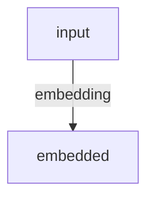
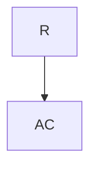

```mermaid
flowchart TD
input --embedding--> embedded  
```

$R^{r\times h}=F^{r\times g}A^{g\times h}$ 

```mermaid
flowchart TD
R--> AC
```

Input file

grid_id,  latitude,  longitude, morning_amount, afternoon_amount, region_id, final_time, final_location

